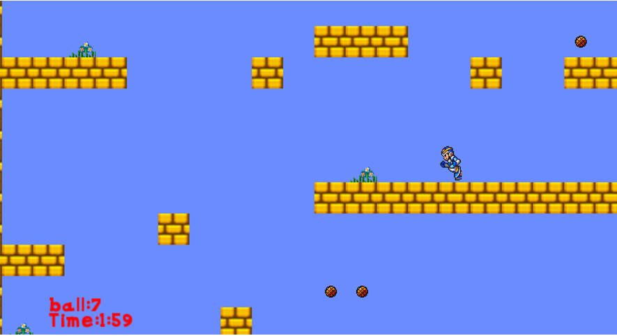
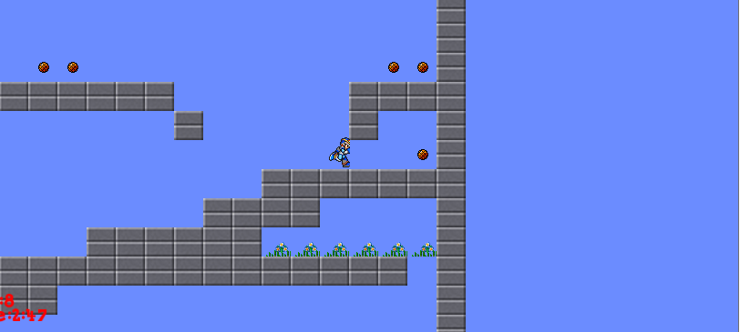
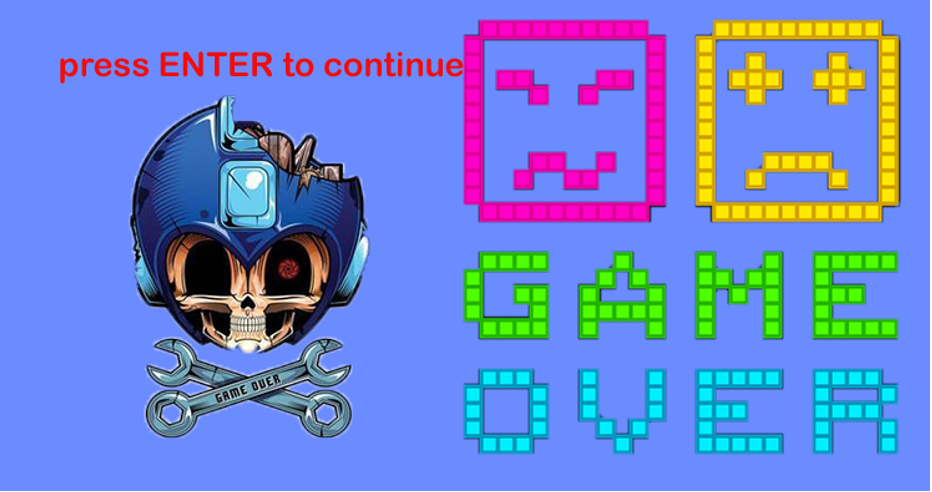
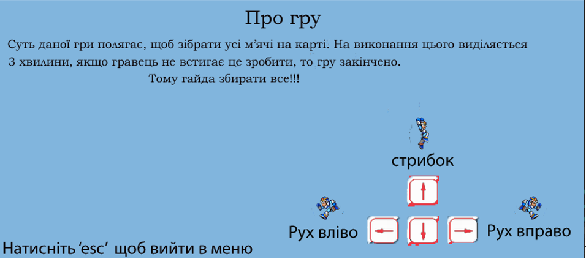

# Game_2D (2020)
My project is a 2D platformer game based on Mega Man. The objective is to collect balls within a specific time limit across four levels. It was developed using C++ and the SFML library.

### Gameplay 
To pass the level, you need to collect all the balls scattered on the map within 3 minutes. Upon completion or defeat, a corresponding notification appears.

### Game over

### Game information window

